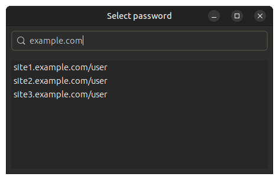

#  GTK-Pass

GTK-Pass is an simple GUI for the [pass] password manager inspired by
[passmenu], except that it uses [GTK] instead of dmenu. It simply lists
all available passwords from your password store (with simple search
available) and when you select one, the password is copied on your clipboard
for 45 seconds.

That's it.

[pass]: https://www.passwordstore.org/
[passmenu]: https://git.zx2c4.com/password-store/tree/contrib/dmenu/passmenu
[GTK]: https://gtk.org/



## Dependencies

- [CMake](https://www.cmake.org)
- [GTKmm](https://gtkmm.org/en/index.html) >= 3.24
- C++11 compiler

## Installation

```bash
$ git clone https://github.com/RauliL/gtk-pass.git
$ cd gtk-pass
$ mkdir build
$ cd build
$ cmake ..
$ make
$ sudo make install
```
